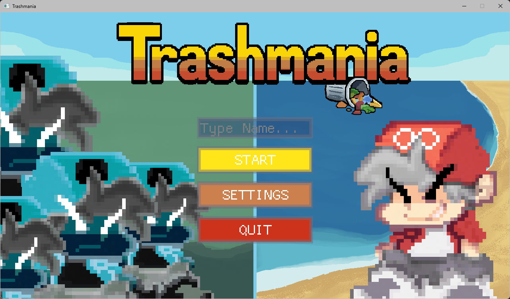
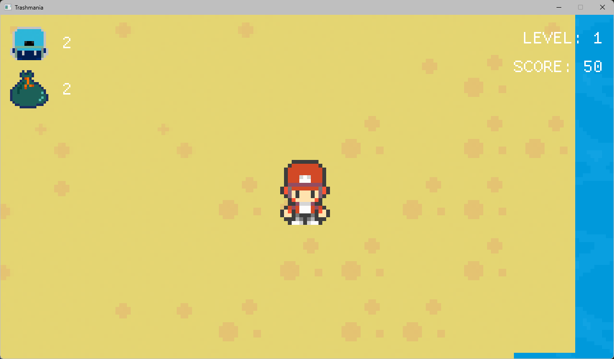

***

# 🗑️ Trashmania

**Trashmania** is a top-down game built using **C++** and **SDL2**. 

 

---

## 🎮 How to Play
*   **The Goal:** Defeat enemies and collect trash as it floats away!
*   **Progression:** The game features procedural difficulty, enemies get faster, more numerous and more aggressive.
*   **Press `TAB`** in-game to toggle the settings menu.

---

## 🛠️ Build Instructions

### Prerequisites
*   A C++17 compatible compiler.
*   **SDL2**, **GLM**, and **ImGui** libraries (already included in `thirdparty/`).

### 🪟 Windows (Visual Studio)
1.  Open Visual Studio.
2.  Select **"Open a local folder"** and choose the project directory.
3.  Visual Studio will detect the `CMakeLists.txt` file.
4.  Press **`Ctrl + S`** on `CMakeLists.txt` to generate the build files.
5.  Select `trashmania.exe` as the startup item and press **CTRL+F5** to build and run.
6.  ⚠️ **IMPORTANT:** Copy the `/resources` folder into the same directory as your generated `.exe` file (only needed if you are running the `PRODUCTION BUILD`).

### 🐧 Linux (Terminal)
1.  Open your terminal in the project root.
2.  Create and enter a build directory:
    ```bash
    mkdir build && cd build
    ```
3.  Generate the build files:
    ```bash
    cmake ..
    ```
4.  Compile the project:
    ```bash
    make
    ```
5.  ⚠️ **IMPORTANT:** Copy the `/resources` folder into the `build` directory next to the binary:
    ```bash
    cp -r ../resources ./
    ./trashmania
    ```

---
